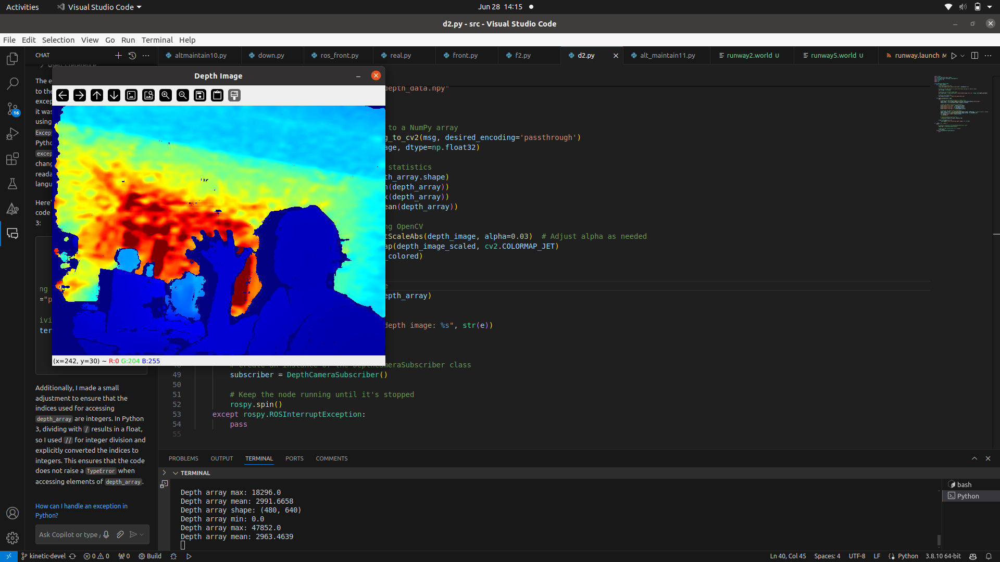

# Terrain-following-using-Depth-Camera-feed
### Objective: Terrain following using depth camera feed

# Overview of algorithm
The drone is equipped with two RealSense depth cameras in this simulation.

Downward-facing camera: Processing is straightforward — we identify the tallest tree and its location by finding the pixel with the smallest depth value in the image.

Front-facing camera: We generate a terrain map using an edge detection algorithm. This visualization can be viewed by running front.py. For a more optimized approach that only searches for the first relevant pixel, f2.py can be used.

[Screencast from 08-07-24 03:21:10 PM IST.webm](pth.mp4)

Once we have data from front and downward facing camera alt_maintain11.py performs decision making for which feed to prioritise and adjusts the z velocity of drone accordingly

# Using Intel real sense hardware

First build [Realsense SDK](https://www.mouser.com/applications/getting-started-with-realsense-d455/)
Then run following command to initialise its node

    roslaunch realsense2_camera rs_camera.launch filters:=pointcloud
    
Now you can visualise depth data using  rviz or d2.py

Now the f2.py equivalent for real hardware is r_front.py

## Note:
The data processing scripts also subscribe to imu data and adjust the data according to the drone tilt to simulate the data in reference to ground plane

# Roll, yaw, pitch in manual control

In altmaintain10.py joystick has been bridged to the guided mode of ardupilot so that pilot can control roll, yaw and pitch of drone whereas altitude is taken care of autonomously

[▶️ Watch Demo Video](https://github.com/prathameshdv/Terrain-following-using-Depth-Camera-feed/blob/main/pth.mp4?raw=true)

